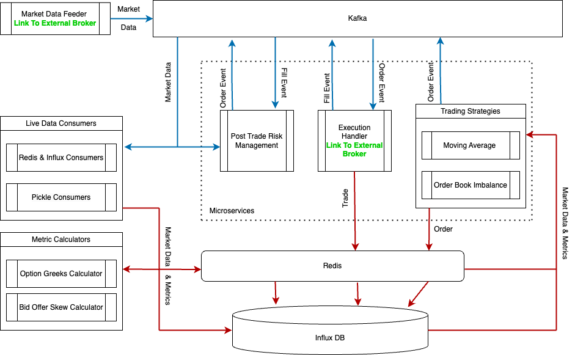

# AlgoFarmLive

# Application Architecture

## Tech Stack

- **InfluxDB**: Used to store all incoming market data and metrics.
- **Redis**: Serves as the caching engine.
- **Kafka**: Acts as the communication method between microservices.
- **Python**: The primary programming language for the application.

## Kafka

- **Live Market Data**: Receives live market data from the Angel API brokerage at a volume of 500 messages per second. Priority is on throughput and efficiency.
- **Messaging for Microservices**: Used as the communication layer between microservices with a lower volume (less than 500 messages per day). Priority is on fast and reliable message delivery without any drops.

## InfluxDB

- A time-series database used to store all incoming market data and metrics.

## Market Data Feeder

- **Location**: 
- Establishes a connection to the external brokerage.
- Receives rates via a WebSocket API and publishes them to Kafka.

## Live Data Consumers

- **Location**: 
- Consumers that receive market data published by the Market Data Feeder to Kafka.
- Each consumer performs a specific task, such as writing market data to a PKL file or updating Redis and InfluxDB.

## Metric Calculators

- **Location**: 
- Queries market data and other data points from Redis/InfluxDB.
- Calculates metrics using the data and writes the results back to Redis and InfluxDB for use by other processes.

## Core Microservices

- **Location**: 

### 1. Trading Service

- Contains several children, each representing a strategy.
- Queries data from Redis/InfluxDB at a specified frequency.
- Generates a **SIGNAL** event containing a list of symbols/tokens with direction, lots, and naïve take profit and stop loss levels.
- Subscribes to **FILL** events and monitors the status of filled trades, generating sophisticated TP and SL levels.
- **Flow**:
  - If no existing trades are open, query the market data for relevant tickers at a specific frequency.
  - Run strategy logic to check if a SIGNAL needs to be generated.
  - Upon satisfying criteria, generate the SIGNAL.
  - The SIGNAL is sent to the execution handler and executed, resulting in a trade saved in cache and DB.
  - A FILL event is generated upon booking the trade, which is consumed by the Trading Service to update active trades.
  - The service continues querying data at the same frequency to check for new entry and exit signals.

### 2. Pre-Trade Risk Service

- **Instance**: Single.
- Subscribes to SIGNAL events and publishes ORDER events.
- Analyzes each SIGNAL event and performs pre-trade checks based on configured trading limits.
  - Ensures incremental order size is within limits.
  - Analyzes each trade's incremental impact on the trading book, considering parameters like notional and delta.

### 3. Execution Handler

- Contains several children, each connecting to a different brokerage service (e.g., Zerodha, Smart API).
- Handles all communication with the brokerage related to order placement.
- Subscribes to ORDER events and publishes FILL events upon execution confirmation.
- Each brokerage has distinct handling procedures.

### 4. Post-Trade Risk Service

- **Instance**: Single.
- Handles all post-trade risk monitoring of active trades.
- Has a direct connection to the Live Market Data Feeder.
- Maintains a list of tickers to monitor and evaluates the PnL of all trades based on current prices.
- Subscribes to FILL events to add filled trades to the monitoring list.
- Publishes ORDER events if any trade hits a TP or SL level.
